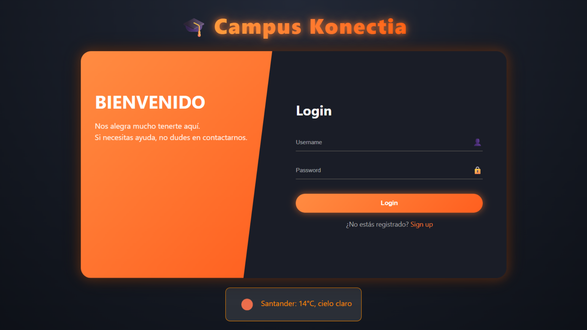
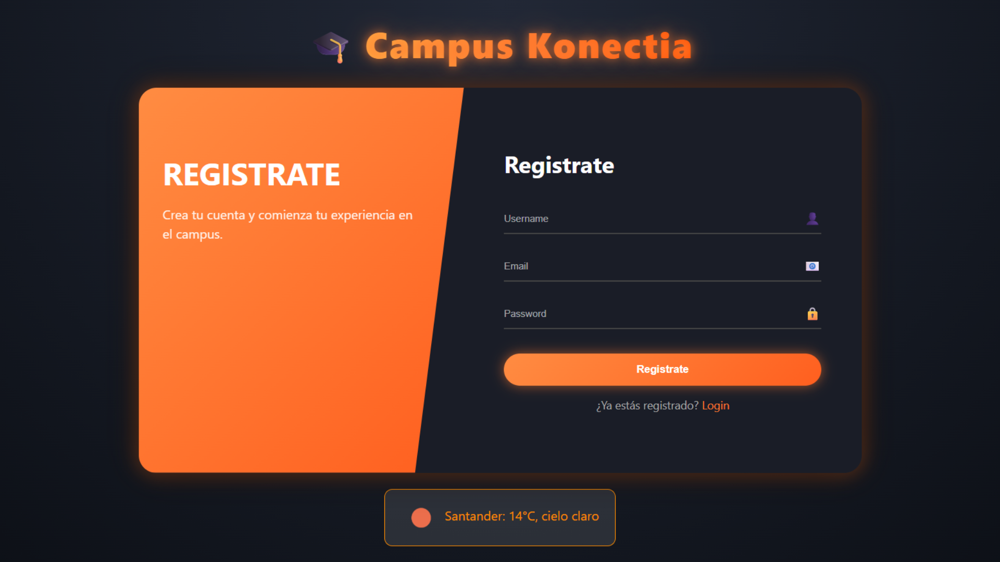
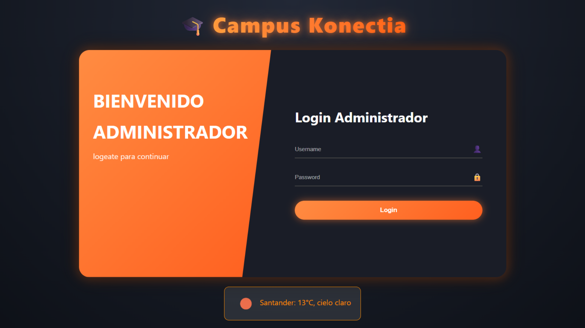
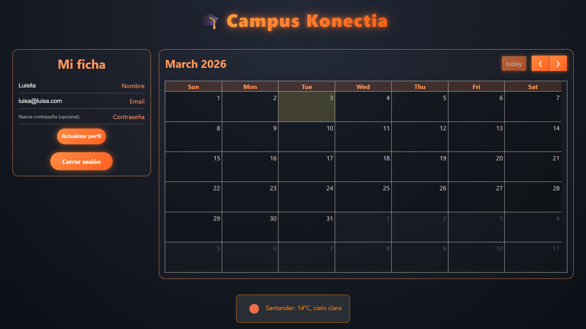
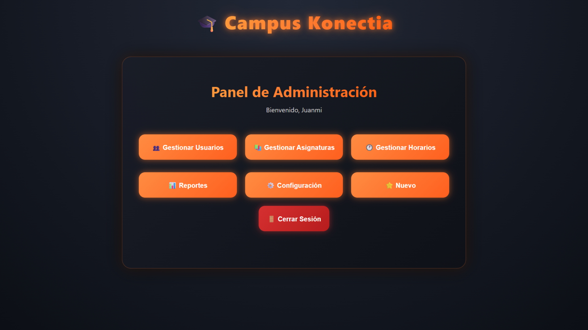
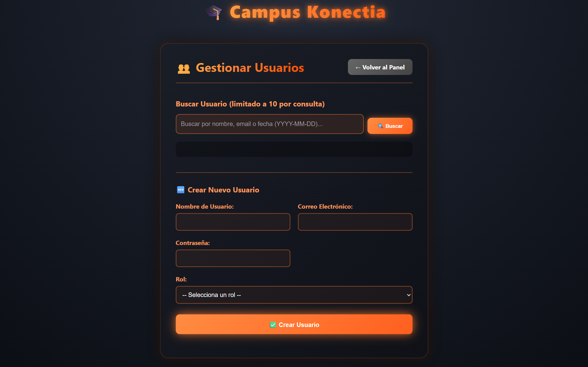

# 🎓 Campus Konectia - Gestión Académica Integral

Campus Konectia es una plataforma educativa profesional diseñada para centralizar la comunicación y gestión entre alumnos, profesores y personal administrativo. El sistema combina una estética moderna de neón con herramientas funcionales de alta productividad.

**🌐 Proyecto Desplegado:** [Visualizar en Railway](https://newclase-fork-production.up.railway.app/)

---

## 📸 Vista Previa del Sistema

La interfaz ha sido diseñada bajo la filosofía de "claridad a un vistazo", organizando la información en bloques lógicos:

* **Panel de Usuario:** Disposición en paralelo (Flexbox) que muestra la ficha técnica del usuario a la izquierda y un calendario expandido a la derecha.
* **Gestión Administrativa:** Sistema de búsqueda en tiempo real y creación de usuarios con generación automática de eventos de bienvenida.
* **Widget Climático:** Integración con OpenWeather API para monitorizar el estado del tiempo en el pie de página.
* **Tablón de Anuncios:** Interfaz administrativa de doble columna con simetría dinámica. Permite la creación, edición y eliminación de comunicados con categorización por prioridades visuales (Normal, Importante, Urgente).
---

## 🚀 Stack Tecnológico

### Backend (Cerebro del sistema)
* **Python / Flask:** Framework ágil para la gestión de rutas y lógica de negocio.
* **PostgreSQL:** Base de Datos relacional para un manejo seguro de usuarios y eventos.
* **Psycopg2:** Adaptador de base de datos para realizar consultas SQL directas y rápidas.
* **Werkzeug:** Implementación de seguridad avanzada para el hashing de contraseñas.

### Frontend (Experiencia de usuario)
* **FullCalendar 6:** Motor de calendario interactivo que permite gestionar la agenda mediante clics y arrastre de elementos.
* **SweetAlert2:** Sustitución de los diálogos nativos del navegador por ventanas modales elegantes para editar o borrar eventos.
* **CSS Neón Personalizado:** Uso de variables CSS, Flexbox y efectos de iluminación para una identidad visual única.
* **JavaScript (Async/Await):** Comunicación asíncrona con el servidor mediante Fetch API para evitar recargas de página innecesarias.

---

## 📂 Organización del Proyecto

El código sigue una estructura modular para facilitar su mantenimiento:

```text
├── app.py              # Configuración global y arranque de la aplicación.
├── auth.py             # Gestión de sesiones, login y perfil del campus.
├── admin.py            # Rutas protegidas para la creación y edición de usuarios.
├── db.py               # Módulo de conexión a la base de datos PostgreSQL.
├── decorators.py       # Decoradores para control de acceso por roles.
├── static/
│   ├── css/            # style.css (global) y calendar.css (estilos neón).
│   └── js/             # calendar.js (lógica agenda) y mod_usuarios.js (admin).
└── templates/          # Plantillas Jinja2 para renderizado dinámico.
```

## 🛠️ Configuración e Instalación Local
Para ejecutar este proyecto en tu entorno local, sigue estos pasos:

1. Clonar el repositorio:

```
git clone [https://github.com/juanmiguelkonectia/New_Clase.git](https://github.com/juanmiguelkonectia/New_Clase.git)
cd New_Clase
```


2. Preparar el entorno virtual:

```
python -m venv venv
source venv/bin/activate  # Windows: venv\Scripts\activate
```

3. Instalar dependencias:

```
pip install -r requirements.txt
```

4. Base de Datos (PostgreSQL):

```
Ejecuta el siguiente esquema para crear los tipos usuarios:

CREATE TYPE public.rol_usuario AS ENUM (
    'Admin',
    'Profesor',
    'Alumno',
    'Oficina'
);
```

```
Ejecuta el siguiente esquema para crear la tabla de usuarios:

CREATE TABLE public.users (
    id_user integer NOT NULL,
    user_name character varying(50) NOT NULL,
    password text NOT NULL,
    user_mail character varying(100) CONSTRAINT users_user_email_not_null NOT NULL,
    creado_en timestamp with time zone NOT NULL,
    actualizado_en timestamp with time zone NOT NULL,
    rol public.rol_usuario NOT NULL
);
```

```
Ejecuta el siguiente esquema para crear la tabla de eventos compatible con el sistema:

CREATE TABLE public.events (
    id_event serial PRIMARY KEY,
    user_id integer REFERENCES public.users(id_user) ON DELETE CASCADE,
    title varchar(200) NOT NULL,
    description text,
    start_date timestamptz NOT NULL,
    end_date timestamptz NOT NULL,
    creado_en timestamptz DEFAULT NOW()
);
```

5. Variables de Entorno:

```
Crea un archivo .env con las siguientes claves:

DATABASE_URL: Enlace de conexión a tu DB.
OPENWEATHER_API_KEY: Tu clave de API de OpenWeather.
SECRET_KEY: Una cadena aleatoria para proteger las sesiones.
```

6. Iniciar servidor:

```
python app.py
```
## Capturas del proyecto

1. **Pantalla Login**


2. **Pantalla de Registro**


3. **Pantalla Login del administrador**


4. **Pantalla de la Ficha del Usuario**


5. **Pantalla del Panel del Administrador**


6. **Pantalla de Edicción de Usuario**


7. **Pantalla de Gestión de Anuncios**


## 📡 Información de Despliegue
Este repositorio está optimizado para Railway. Cada vez que realices un git push a la rama principal, el sistema se actualizará automáticamente, gestionando las variables de entorno y la base de datos de forma nativa.

## 📝 Notas del Desarrollador
Edición de Eventos: Al hacer clic en un evento del calendario, se abrirá un menú de SweetAlert2 que permite modificar el título o borrar el registro directamente sin escribir comandos.

Registro Admin: Cuando el administrador crea un usuario desde el panel, el sistema genera automáticamente un evento de "Bienvenido al campus" en la agenda del nuevo usuario.

## 🧠 Arquitectura y Funcionamiento Técnico

Entender cómo se conectan las piezas de este proyecto es clave para comprender el flujo de datos. La aplicación utiliza un modelo **cliente-servidor**: el navegador (cliente) se encarga de la interfaz, mientras que Python/Flask (servidor) gestiona la lógica y la base de datos.

### 1. Gestión Dinámica del Calendario
El calendario no es un dibujo estático de HTML, sino una aplicación dinámica generada mediante:

* **Tecnología:** [FullCalendar 6](https://fullcalendar.io/). Esta librería de JavaScript transforma un contenedor vacío `<div id="calendar"></div>` en una interfaz interactiva completa.
* **Inicialización:** Se utiliza el método `FullCalendar.Calendar`. El archivo `calendar.js` selecciona el elemento del DOM y lo configura con un objeto de JavaScript que define la estética, la capacidad de arrastrar eventos y el origen de los datos.
* **Comunicación Asíncrona (Fetch API):** Los eventos no están grabados en el código. El calendario utiliza el parámetro `events: '/campus/get_events'`, lo que permite que el navegador pida a Flask los datos de los eventos en segundo plano cada vez que el usuario cambia de mes, sin necesidad de recargar la página completa.

### 2. Automatización: El "Trigger" de Bienvenida
El evento de "Bienvenida" se genera en el **Backend** en el momento exacto en que se valida un nuevo registro. El flujo lógico es el siguiente:

1.  **Captura de datos:** Al pulsar "Crear Usuario" en el panel de administración, se envía un objeto JSON a la ruta `/crear-usuario` en `admin.py`.
2.  **El Disparador (Trigger):** Dentro de la función de creación, tras insertar los datos del usuario, se ejecuta la cláusula SQL `RETURNING id_user`. Este es el punto crítico: obtenemos el ID único generado por la base de datos para vincular el calendario al usuario correcto.
3.  **Inserción Vinculada:** Con el ID en mano, el sistema ejecuta automáticamente un segundo `INSERT` en la tabla `public.events`.

### 3. Sistema de Anuncios y Simetría de Interfaz
La sección de anuncios implementa una experiencia de usuario (UX) centrada en la proporcionalidad:
* **Arquitectura Flexbox "Stretch":** La caja de anuncios activos iguala automáticamente la altura del formulario de creación para mantener el equilibrio visual.
* **Gestión de Desbordamiento:** Utiliza un contenedor con `overflow-y: auto`, permitiendo la navegación por scroll interno sin afectar al layout global de la página.
* **Priorización Visual:** Categorización dinámica mediante bordes laterales de colores según la importancia del mensaje (Urgente 🔴, Importante 🟡, Normal 🔵).

**Detalles técnicos del evento automático:**
* **Título:** "Bienvenido al campus".
* **Tiempo:** Se usa la función `NOW()` de PostgreSQL para fijar el inicio en el momento actual.
* **Duración:** Se define un `INTERVAL '1 hour'` para que el bloque visual sea claramente visible en la agenda.

---

### 📊 Resumen de Responsabilidades

| Capa | Herramienta | Acción Clave |
| :--- | :--- | :--- |
| **Visualización** | FullCalendar JS | Renderiza el HTML y detecta interacciones del usuario. |
| **Persistencia** | PostgreSQL | Almacena y protege los datos en la tabla `public.events`. |
| **Lógica / Puente** | Flask (Python) | Procesa las peticiones y automatiza la creación de eventos. |


Este flujo garantiza que, en cuanto el usuario inicie sesión por primera vez, su agenda ya contenga el evento de bienvenida esperándole.